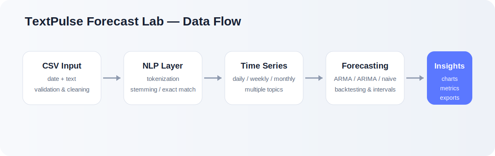

# TextPulse Forecast Lab

**TextPulse Forecast Lab** turns dated text into measurable topic trends and short-term forecasts. It combines lightweight natural-language processing with time-series modelling in a professional Streamlit dashboard.

[](https://github.com/AderoVick/stem-arma-lab/actions/workflows/python-package.yml)


[**Project website**](https://aderovick.github.io/stem-arma-lab/) · [**Live dashboard**](https://stem-arma-lab.streamlit.app/) · [**Deployment guide**](DEPLOYMENT.md)

The repository contains two connected experiences: a responsive GitHub Pages landing page in `index.html`, and the interactive Streamlit dashboard launched from `streamlit_app.py`.



## Why this project matters

Organizations often collect text with timestamps—support tickets, customer feedback, news headlines, survey comments, incident reports, and social posts—but struggle to measure how topics change over time. TextPulse converts those records into an evenly spaced count series, evaluates forecasting approaches, and presents the results with uncertainty ranges and downloadable outputs.

## Version 2 highlights

- Uploads are processed **in memory** instead of being written to a shared file.
- CSV columns are matched case-insensitively and validated with clear error messages.
- Invalid dates, blank text, and exact duplicates are reported and removed.
- Users can compare **multiple topics** on daily, weekly, or monthly timelines.
- Topic matching supports Porter stemming or exact-word matching.
- The dashboard suggests frequent searchable topics without downloading an NLTK corpus.
- Forecasting supports manual ARIMA orders and automatic backtested model selection.
- A naive baseline is included so statistical models must demonstrate real improvement.
- Results include MAE, RMSE, sMAPE, confidence intervals, residual diagnostics, AIC, and BIC.
- Aggregated data and forecasts can be downloaded as CSV files.
- The project includes tests, CI checks, Docker support, and a Streamlit Cloud entry point.

## Dashboard sections

### Overview

Review record counts, date coverage, total topic mentions, data-quality results, source preview, and a multi-topic trend chart.

### Explore

Inspect frequent topic candidates, topic-level summary statistics, the aggregated time series, and downloadable processed data.

### Forecast

Select one tracked topic, choose automatic or manual modelling, set the forecast horizon and confidence level, then inspect the forecast and backtest metrics.

### Diagnostics

Compare candidate models and examine residual behaviour, AIC, BIC, residual mean, and residual standard deviation.

## Data format

Provide a CSV file containing `date` and `text` columns:

```csv
date,text
2026-01-01,"Traffic delays increased after the road closure."
2026-01-02,"New traffic signals improved vehicle flow downtown."
```

Column names are case-insensitive. Dates that cannot be parsed and rows with blank text are removed and reported in the dashboard.

## Architecture

```text
CSV / uploaded file
        │
        ▼
Validation and cleaning
        │
        ▼
Tokenization and topic normalization
        │
        ▼
Daily / weekly / monthly count series
        │
        ▼
Backtesting and model comparison
        │
        ▼
Forecast, confidence interval, diagnostics, exports
```

## Project structure

```text
stem-arma-lab/
├── index.html                # GitHub Pages project landing page
├── assets/site.css           # Landing-page design system
├── assets/site.js            # Navigation and reveal interactions
├── streamlit_app.py          # Streamlit Cloud entry point
├── ui/
│   └── App.py                # Dashboard and visualizations
├── src/
│   ├── data_loader.py        # CSV validation and quality reporting
│   ├── text_analysis.py      # NLP and topic time-series creation
│   ├── forecasting.py        # Forecasting, metrics, and model comparison
│   ├── main.py               # Command-line interface
│   ├── preprocess.py         # Backward-compatible helpers
│   └── arma_model.py         # Backward-compatible ARMA wrappers
├── tests/                    # Automated unit tests
├── data/sample_text.csv      # Demonstration dataset
├── assets/architecture.svg
├── .streamlit/config.toml
├── Dockerfile
├── requirements.txt
└── requirements-dev.txt
```

## Local installation

### 1. Clone the repository

```bash
git clone https://github.com/AderoVick/stem-arma-lab.git
cd stem-arma-lab
```

### 2. Create a virtual environment

```bash
python -m venv .venv
```

Activate it on Windows:

```powershell
.\.venv\Scripts\activate
```

Activate it on macOS or Linux:

```bash
source .venv/bin/activate
```

### 3. Install dependencies

```bash
python -m pip install --upgrade pip
pip install -r requirements.txt
```

### 4. Run the dashboard

```bash
streamlit run streamlit_app.py
```

The previous command remains supported:

```bash
streamlit run ui/App.py
```

## Command-line usage

Automatic model selection:

```bash
python -m src.main \
  --csv data/sample_text.csv \
  --topic traffic \
  --steps 14 \
  --output outputs/traffic_forecast.csv
```

Manual ARIMA model:

```bash
python -m src.main \
  --csv data/sample_text.csv \
  --topic climate \
  --manual \
  --p 1 --d 1 --q 1 \
  --steps 14
```

## Run tests

```bash
pip install -r requirements-dev.txt
python -m pytest
```

Critical syntax and undefined-name lint check:

```bash
python -m flake8 src ui tests streamlit_app.py \
  --select=E9,F63,F7,F82 \
  --show-source --statistics
```

## Deploy on Streamlit Community Cloud

1. Push this repository to GitHub.
2. Open Streamlit Community Cloud and create an app.
3. Select the repository and the `main` branch.
4. Set the app file to `streamlit_app.py`.
5. Deploy.

The application does not require API keys or downloadable NLP corpora.

## Run with Docker

```bash
docker build -t textpulse-forecast-lab .
docker run --rm -p 8501:8501 textpulse-forecast-lab
```

Open `http://localhost:8501` in a browser.

## Modelling notes

The automatic workflow backtests a compact set of ARMA/ARIMA candidates and a naive baseline on the most recent observations. The successful model with the lowest RMSE is selected, using MAE and sMAPE as tie-breakers. Forecast values and confidence limits are clipped at zero because topic mentions are non-negative counts.

This application is an analytical learning and decision-support tool. Forecast accuracy depends on data volume, temporal consistency, topic frequency, and structural changes in the underlying process. Confidence intervals describe model uncertainty; they do not guarantee future outcomes.

## Possible future extensions

- sentiment trends alongside topic frequency,
- lemmatization with a packaged language model,
- seasonal models and count-specific forecasting,
- rolling-origin cross-validation,
- user-defined stopword lists,
- saved analysis sessions,
- PDF or HTML report generation,
- multilingual tokenization.

## License

Released under the [MIT License](LICENSE).
